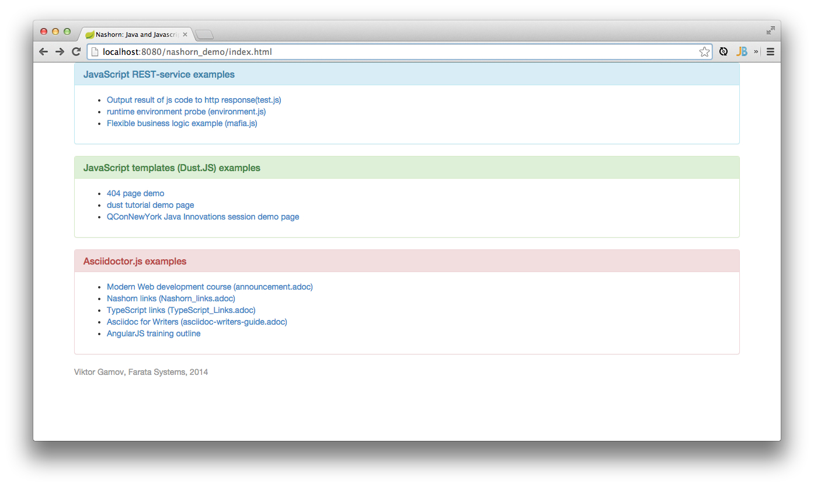

== Nashorn: Java & JavaScript. Shaken, Not Stirred

Example application demonstrates usage of Scripting API for Java platform (http://www.jcp.org/en/jsr/detail?id=223[JSR-223]) with Nashorn JavaScript engine.

Presented on:

* JavaOne (October 2013)
* NY JavaSIG (January 2014)
* PrincetonJUG (February 2014)

* http://next.javaheadbrain.com/slidedecks/java_javascript_shaken_not_stirred/index.html[View slides online]
* http://next.javaheadbrain.com/slidedecks/java_javascript_shaken_not_stirred/NYJAVASIG_2014_Nashorn_v4.pdf[PDF slides (latest version)]
* https://www.youtube.com/watch?v=Othz7Ny6bq0[Presentation (*1080p* video, slides and voice-over)]

=== Used technologies ===

_TODO_

=== How to build

==== Java

[source, shell]
----------------------------------------------------------------------
./gradlew clean build
----------------------------------------------------------------------

=== How to run

- build the application with JDK8
- download http://dlc.sun.com.edgesuite.net/glassfish/4.0/release/glassfish-4.0-ml.zip[Glassfish 4 Java EE 7]
- unpack in any directory
- go to +glassfish_dir/bin+ start server with command
+

[source, shell]
----------------------------------------------------------------------
./asadmin start-domain domain1
----------------------------------------------------------------------

- grab war file from +build\lib+ directory and drop it to +glassfish_dir/glassfish/domains/domain1/autodeploy+ directory
- once you'll see `nashorn_demo.war_deployed` using browser go to URL http://localhost:8080/nashorn_demo

